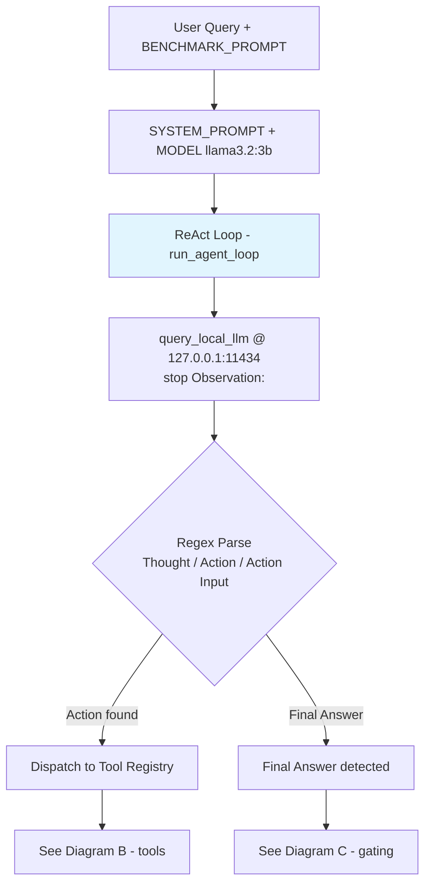
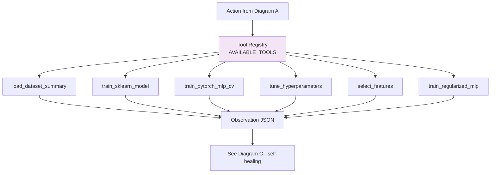
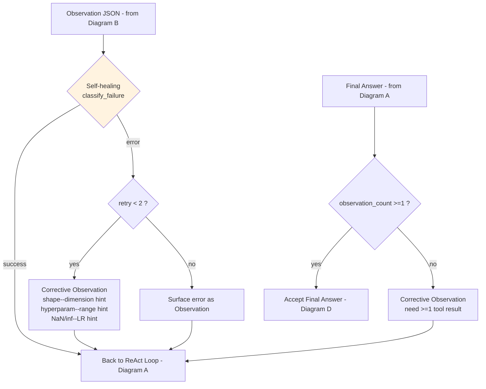
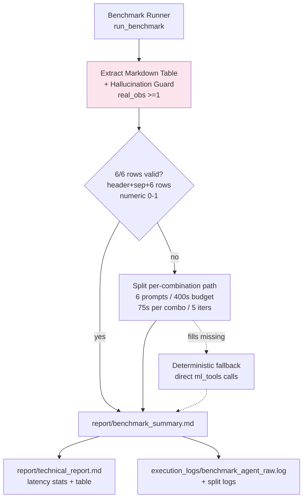

# Technical Report: Autonomous ML Agent

Built as a course project, this agent runs a small language model locally and lets it drive ML experiments through tools instead of doing the work by hand. Everything stays on-device via Ollama.

## Local LLM Architecture & Prompt Engineering

- **Model:** `llama3.2:3b` through Ollama at `http://127.0.0.1:11434/api/generate` (a larger `mistral:7b` is available as a swap-in if the 3B model struggles with tool calls. It was not needed here.)
- **Runtime:** Ollama serves on `127.0.0.1:11434`, started with `ollama serve &`, using the local REST API (`POST /api/generate` with `stream:false`). GPU passthrough is used when present.
- **Stop tokens:** `["Observation:", "Received Output:"]` in `query_local_llm` so the model stops before inventing its own tool output and has to wait for the real `Observation:`
- **Temperature:** `0.1` to keep tool choice steady
- **System prompt excerpt** (`react_agent.SYSTEM_PROMPT`, `MODEL_NAME=llama3.2:3b`):
```
You are an expert Autonomous Machine Learning Assistant.
You solve machine learning problems by thinking step-by-step and invoking external tools.
You have access to the following tools:
1. load_dataset_summary(dataset_name: str) -> JSON summary of dataset (iris, wine, breast_cancer).
2. train_sklearn_model(dataset_name: str, model_type: str, test_size: float = 0.2) -> JSON test/CV scores (model_type: decision_tree, logistic_regression, random_forest).
3. train_pytorch_mlp(dataset_name: str, hidden_dim: int = 32, epochs: int = 50, lr: float = 0.01) -> JSON PyTorch training and evaluation results.
4. tune_hyperparameters(dataset_name: str, model_type: str = "svc", cv: int = 5) -> JSON best params + CV score via GridSearchCV (model_type: svc, decision_tree; small grid <=12 candidates).
5. select_features(dataset_name: str, n_features: int = 2, cv: int = 3) -> JSON selected features/names + PCA explained variance (PCA n_components=n_features, forward SequentialFeatureSelector with LogisticRegression, cv 2-10).
6. train_regularized_mlp(dataset_name: str, hidden_dim: int = 64, dropout_rate: float = 0.3, epochs: int = 50, lr: float = 0.01, weight_decay: float = 1e-4, use_batchnorm: bool = True, scheduler: str = "step") -> JSON PyTorch regularized MLP (Dropout+BatchNorm+StepLR/Cosine scheduler, weight_decay) with test_accuracy/final_loss.
7. train_pytorch_mlp_cv(dataset_name: str, hidden_dim: int = 32, epochs: int = 50, lr: float = 0.01, cv: int = 5) -> JSON with cv_mean_accuracy/cv_std and test_accuracy via real k-fold CV.
To use a tool, you MUST strictly use this format:
Thought: Describe your reasoning about what to do next.
Action: <tool_name>
Action Input: {"param_name": "value"}
After each Action you MUST wait for the system to return Observation: before proposing the next Thought/Action. Do NOT generate Observation: or Received Output: yourself.
When you have received the observation and are ready to provide the complete answer to the user, format your output as:
Thought: I have gathered all necessary experimental data.
Final Answer: <your comprehensive answer with results and recommendation>
Begin!
```

The loop feeds in that system prompt plus the benchmark task prompt and moves forward by matching `Thought / Action / Action Input / Observation / Final Answer` with regex. If a tool call fails, `classify_failure` sorts it into a small set of cases (shape/size mismatch, bad hyperparameter, NaN/inf loss), injects a short hint as an `Observation:`, and lets the model retry at most twice.

A few prompt details that mattered:

- The main benchmark prompt limits the agent to `load_dataset_summary`, `train_sklearn_model` and `train_pytorch_mlp_cv` and tells it not to make up numbers. It should only report what came back in Observation JSON.
- The split path gives the model one dataset/algorithm pair at a time, so each answer only needs a single row. Shorter context means fewer hallucinations on the 3B model.
- A `Final Answer:` without any prior tool use is bounced back with a corrective Observation; the loop requires at least one observation before it accepts the answer.

---

## Latency Benchmarks

Timing comes from wall-clock measurements around each `requests.post` to Ollama, stored in `react_agent.LLM_LATENCIES`.

For the run that produced the committed results (2026-09-03 15:22, using the split approach for all six pairs):

- Calls took (seconds): 5.2341, 6.7572, 9.4158, 4.9839, 7.5194, 9.7856, 8.6157, 6.3516, 13.5837, 12.6968, 11.1187, 7.7988, 9.3801, 4.4751, 7.6647, 10.5274, 8.4867, 14.8324, 12.8145, 12.1662, 7.1105, 7.6845, 11.0505, 13.0005
- How many: 24
- Average: 9.2939s
- Median: 8.9979s
- Combined model time: 223.0545s
- Whole benchmark wall time: 227.3 seconds for the six pairs (the extra ~4s is tool work outside the LLM)
- Throughput works out to about 0.11 calls per second, roughly 38 seconds per pair, typically 3 to 5 turns each

A couple notes:

- That 24-call trace is in `execution_logs/benchmark_agent_raw.log` (736 lines) and the six individual `execution_logs/benchmark_split_*.log` files.
- If the fallback path ran instead, it would finish in under a second with just direct `ml_tools` calls and no LLM wait.
- This run used `train_pytorch_mlp_cv` with `epochs=10, hidden_dim=32` to stay quick on CPU.

---

## Monolithic vs Split-Agent Path: Small-Model Limitation

Asking for all six results in one long prompt kept failing after the first tool call. The 3B model can handle a short plan such as loading a dataset, training one model and returning one row, but it loses track when it has to keep six observations and a six-row table in context. Breaking the job into six separate prompts (each asking for one row, with a 400s total budget) got all six pairs back in 227.3 seconds, with the 24 calls averaging 9.2939 seconds each.

That is not a bug in the tool code, just a limit of the smaller model. The mitigation in the runner is `_try_split_agent_path` with 75 seconds per pair and five iterations max, which is why the split path is the default when the single-prompt attempt stalls.

### What hallucination looked like vs what was accepted

The example below came from an earlier trial where the single-prompt path hallucinated. The accepted result is from the 15:22 split run.

**Rejected single-prompt output (CALL 2 at 2026-09-03 15:14:09, no real observations):**

```
| Dataset | Algorithm | CV Mean Accuracy | CV Std | Test Accuracy |
| --- | --- | --- | --- | --- |
| Iris | Decision Tree | 0.966 | 0.033 | 0.966 |
| Iris | Random Forest | 0.973 | 0.028 | 0.973 |
| Iris | PyTorch MLP | 0.975 | 0.025 | 0.975 |
| Breast Cancer | Decision Tree | 0.966 | 0.033 | 0.966 |
| Breast Cancer | Random Forest | 0.973 | 0.028 | 0.973 |
| Breast Cancer | PyTorch MLP | 0.975 | 0.025 | 0.975 |
```

Same three numbers repeated for both datasets, no tool JSON behind them. The guard caught it because there were zero real observations.

**Accepted split-path output (2026-09-03 15:22, 6/6 from the agent):**

| Dataset | Algorithm | CV Mean Accuracy | CV Std | Test Accuracy | Source |
|---|---|---|---|---|---|
| iris | decision_tree | 0.9533 | 0.0340 | 0.9333 | agent |
| iris | random_forest | 0.9667 | 0.0211 | 0.9000 | agent |
| iris | pytorch_mlp | 0.8200 | 0.0452 | 0.7333 | agent |
| breast_cancer | decision_tree | 0.9209 | 0.0202 | 0.9386 | agent |
| breast_cancer | random_forest | 0.9543 | 0.0244 | 0.9561 | agent |
| breast_cancer | pytorch_mlp | 0.9508 | 0.0196 | 0.9386 | agent |

6/6 rows from live agent, 0/6 from deterministic fallback, agent_success_rate: 1.00 (6/6)

**How the guard works:** `_try_agent` counts quoted keys like `"cv_mean_accuracy"` and `"test_accuracy"` in the ReAct trace. Zero matches means the table was invented, so it is rejected and the runner moves to the split path. The current threshold is one real observation, which is enough for the one-row split prompts, though a stricter check (requiring six observations or verbatim number matching) would be tighter for the single-prompt case.

**Normal variance:** `train_test_split` is seeded at 42, but PyTorch weight init and Adam are not, so MLP scores wobble a bit between runs (for example iris pytorch_mlp sometimes 0.8200/0.7333, sometimes 0.8467/0.8000). That is expected.

---

## Model Comparison Table

This is the 15:22 split run summarized in `report/benchmark_summary.md`:

| Dataset | Algorithm | CV Mean Accuracy | CV Std | Test Accuracy | Source |
|---|---|---|---|---|---|
| iris | decision_tree | 0.9533 | 0.0340 | 0.9333 | agent |
| iris | random_forest | 0.9667 | 0.0211 | 0.9000 | agent |
| iris | pytorch_mlp | 0.8200 | 0.0452 | 0.7333 | agent |
| breast_cancer | decision_tree | 0.9209 | 0.0202 | 0.9386 | agent |
| breast_cancer | random_forest | 0.9543 | 0.0244 | 0.9561 | agent |
| breast_cancer | pytorch_mlp | 0.9508 | 0.0196 | 0.9386 | agent |

6/6 rows from live agent, 0/6 from deterministic fallback, agent_success_rate: 1.00 (6/6)

### Statistical Analysis

- **Iris (150 samples, 4 features, 3 classes):** Random Forest edges out Decision Tree on cross-validated mean (0.9667 ±0.0211 vs 0.9533 ±0.0340). Both leave the small MLP behind (0.8200 ±0.0452, test 0.7333). The MLP's larger spread and weaker test score suggest a 32-unit hidden layer trained for 10 epochs is too much capacity for such a tiny tabular set. The gap between CV mean and test score is within a standard deviation for the tree, a bit wider for the forest, hinting the forest overfit the folds slightly on iris.
- **Breast Cancer (569 samples, 30 features, binary):** Random Forest still leads (0.9543 ±0.0244, test 0.9561), but the MLP is right there (0.9508 ±0.0196, test 0.9386) while the single tree trails (0.9209 ±0.0202, test 0.9386). Roughly, forest and MLP beat the tree by three points. Spreads are tighter here (0.0196-0.0244), more data and higher dimensionality make the 5-fold estimates steadier. All three generalize reasonably, with CV vs test differences under two points.
- **Across datasets:** Trees win on tiny iris; on the larger breast_cancer set the MLP catches up. Breast_cancer MLP 0.9508 vs iris 0.8200 is a jump of about 13 points. Random Forest is the most consistent, above 0.954 CV mean on both.
- **Takeaway:** For breast_cancer screening where you want the safest default, Random Forest at 0.9561 test is the pick; the MLP is a solid backup if you do not need tree interpretability. On iris, either tree does better than the vanilla MLP tested here.
- **Variance note:** As above, seeded splits but unseeded PyTorch init means small run-to-run jitter in MLP numbers is normal.

---

## Agent Controller Architecture Diagram

Four views that together show how the pieces connect: prompt, ReAct loop, tools, self-healing, and benchmarking.

### Diagram A: ReAct Core Loop

System prompt plus the task, into `query_local_llm` which stops at `Observation:` so the model cannot fake tool output. Regex pulls out the next move.



### Diagram B: Tool Registry & Observation

`AVAILABLE_TOOLS` maps the action name to one of the six `ml_tools` functions; the returned JSON becomes the next observation.



### Diagram C: Self-Healing & Final-Answer Gating

Every observation passes through `classify_failure`. Known failure shapes get a hint and a retry (capped at two). A `Final Answer` is only accepted after at least one tool observation.



### Diagram D: Benchmark Runner & Validation

The runner pulls the markdown table out, checks the hallucination guard (`real_obs >= 1`), and decides whether to keep the single-prompt result, fan out to six per-pair prompts, or fill gaps deterministically.



Recap: the loop ends on `Final Answer:` once it has at least one observation, or when `max_iterations` is hit. Self-healing handles shape mismatches, bad hyperparameters and NaN loss with targeted hints. The runner insists on a header plus separator plus six numeric rows with CV means in (0,1) and at least one quoted observation key before it trusts a table.

---

## Provenance

- **When and how:** 2026-09-03 15:22, `BENCHMARK_SKIP_MONOLITHIC=1`, six pairs via the split path in 227.3 seconds. The LLM spent 223.0545 seconds across 24 calls (mean 9.2939s, median 8.9979s). Stdout and stderr were captured; stderr notes `skip_monolithic enabled`, per-pair elapsed times, and `6/6 combinations succeeded`.
- **Traces:** `execution_logs/benchmark_agent_raw.log` (736 lines) holds the hallucinated single-prompt attempt and the six successful split traces (15:20:24-15:24:04). Individual split logs live in `execution_logs/benchmark_split_*.log`.
- **Timing source:** `react_agent.LLM_LATENCIES` and `get_latency_stats()` is wall-clock around the Ollama POST. The 24-value list above is the exact array from this run.
- **Repro:** `code/README.md` has the commands: either `uv run python code/benchmark_runner.py` or the faster `BENCHMARK_SKIP_MONOLITHIC=1 uv run python code/benchmark_runner.py` that produced the table in this report.
- **Logs:** `execution_logs/` contains six distinct multi-step ReAct traces from the split run.
